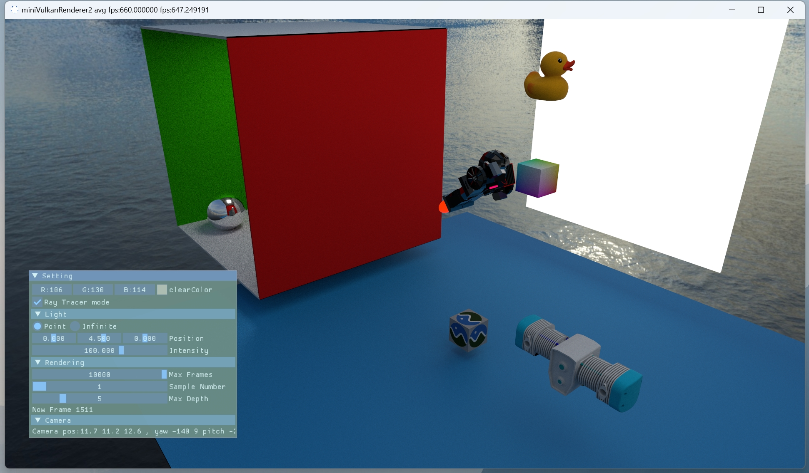
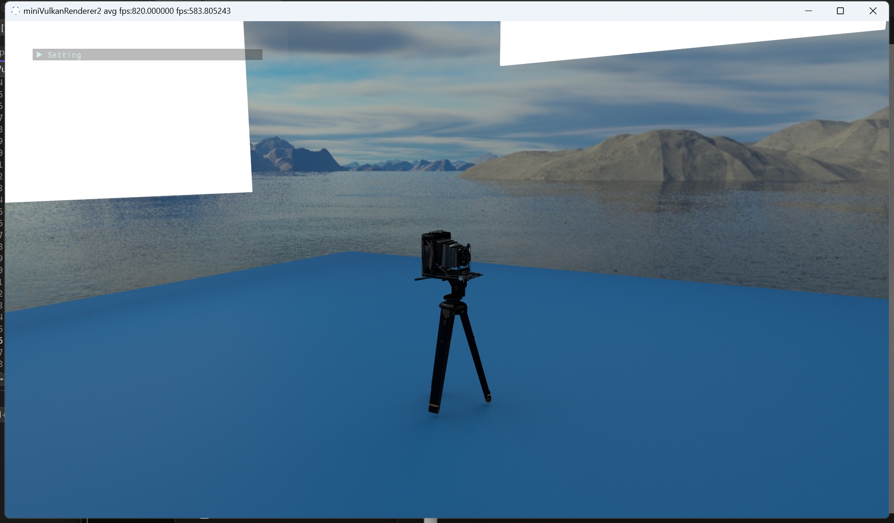
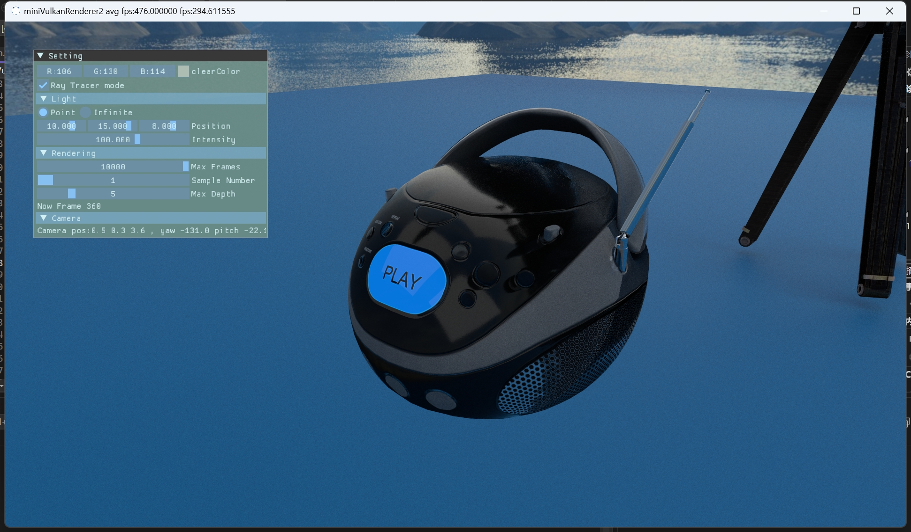
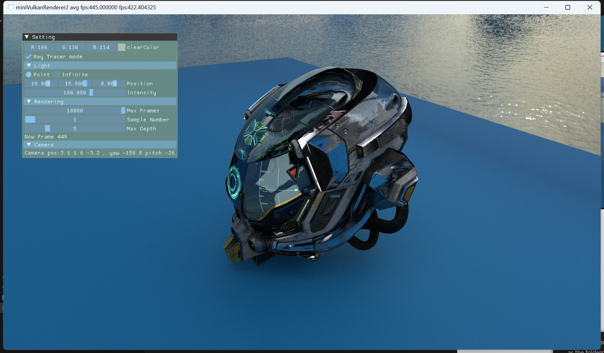
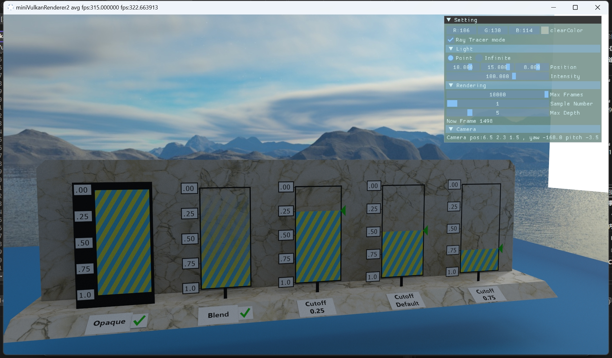
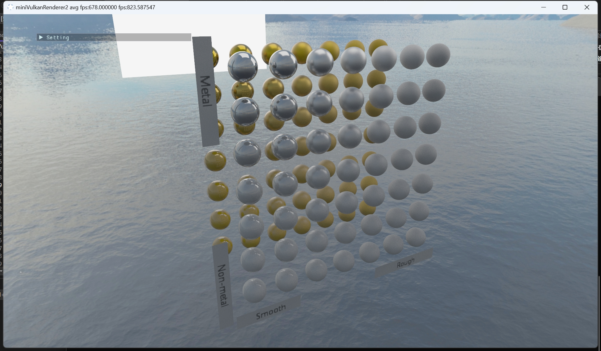
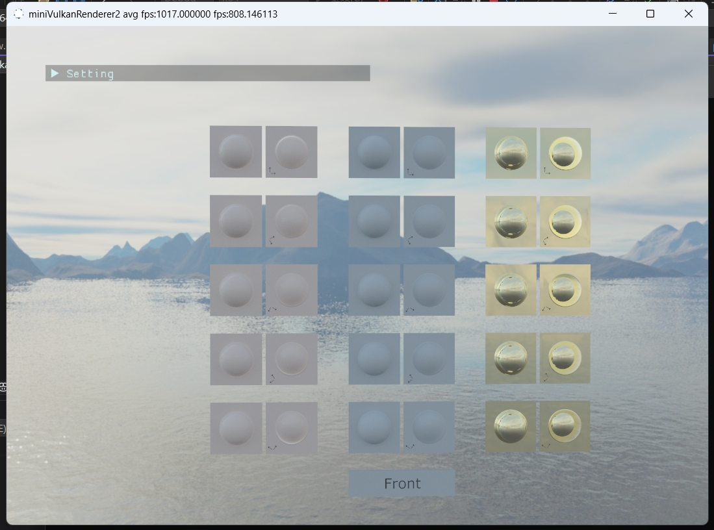
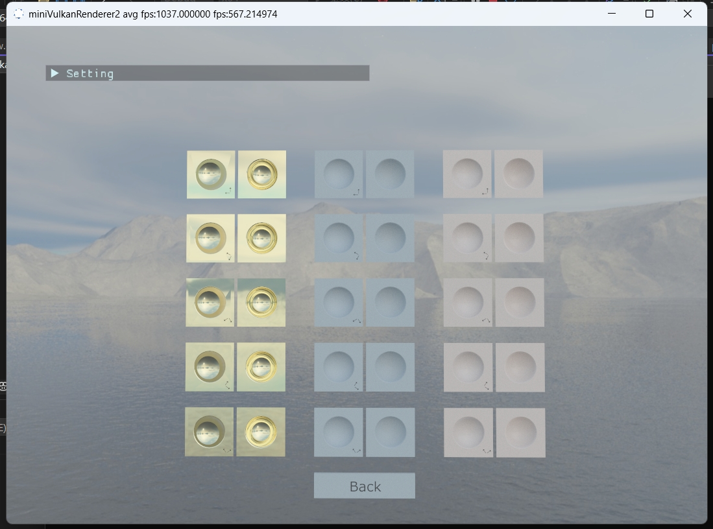
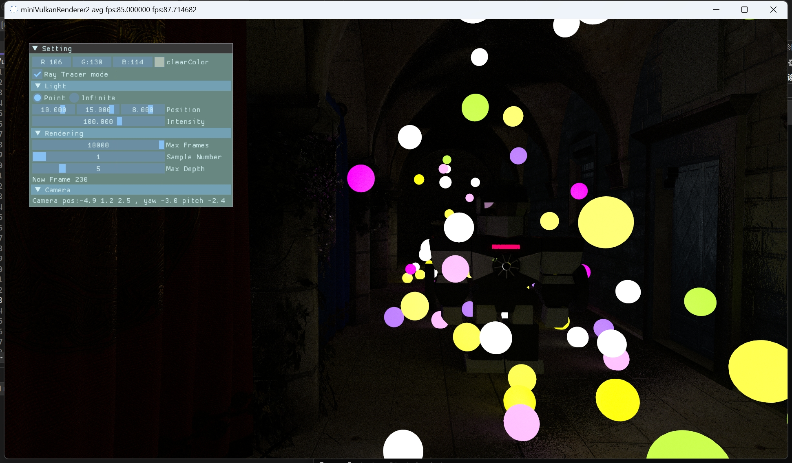
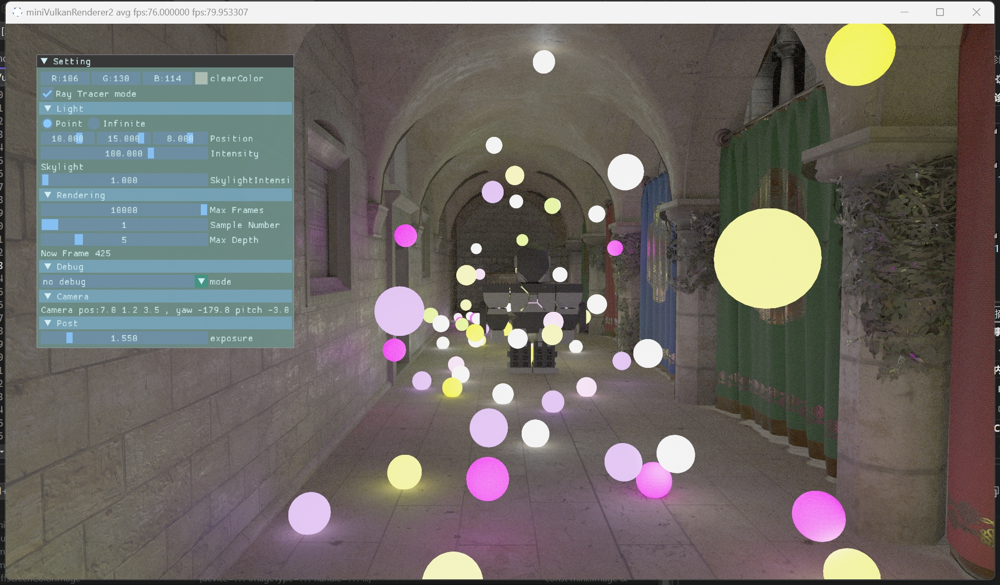

# miniVulkanRenderer2
 A mini renderer using Vulkan
 ## 1. Features
 * PBR
 * PathTrace
 ## 2. Screenshot

 ### 2.1 RayTracing
* Demo

* Normal Map 

* Emission 

* Alpha Test

* MetalRoughSpheres

* Normal Tangent Test

* HDR

### 2.2 Raster

## 3. ThirdParty
* imgui
* tinygltf
* tinyobjloader
* volk
* stb_image
