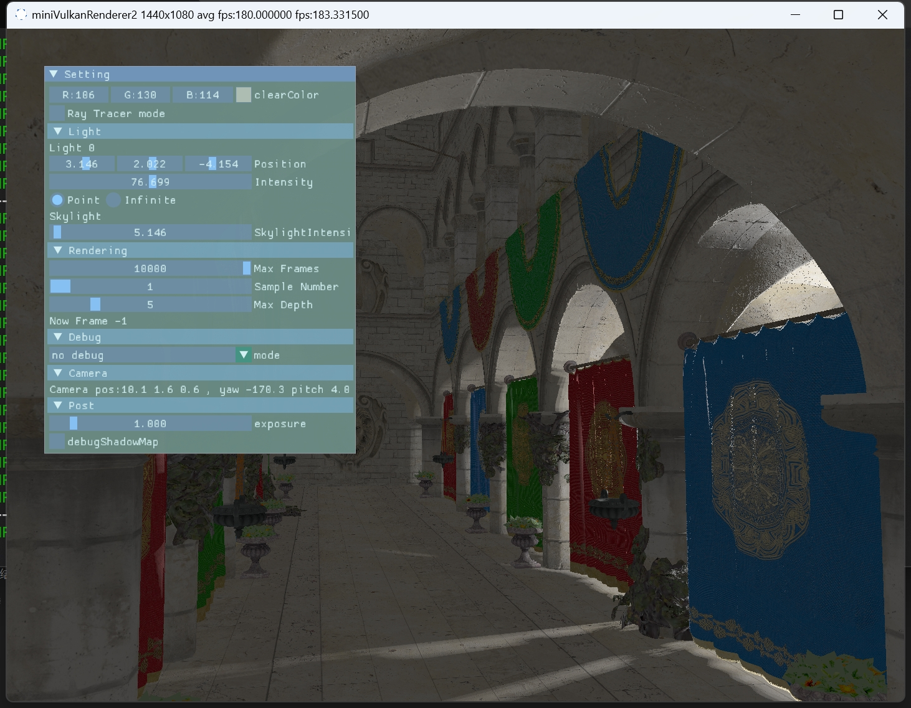
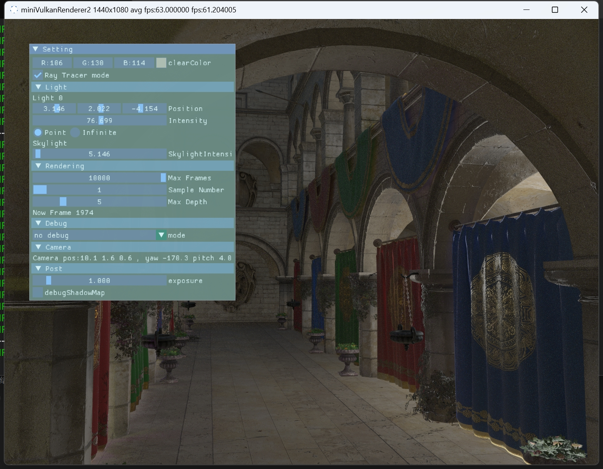
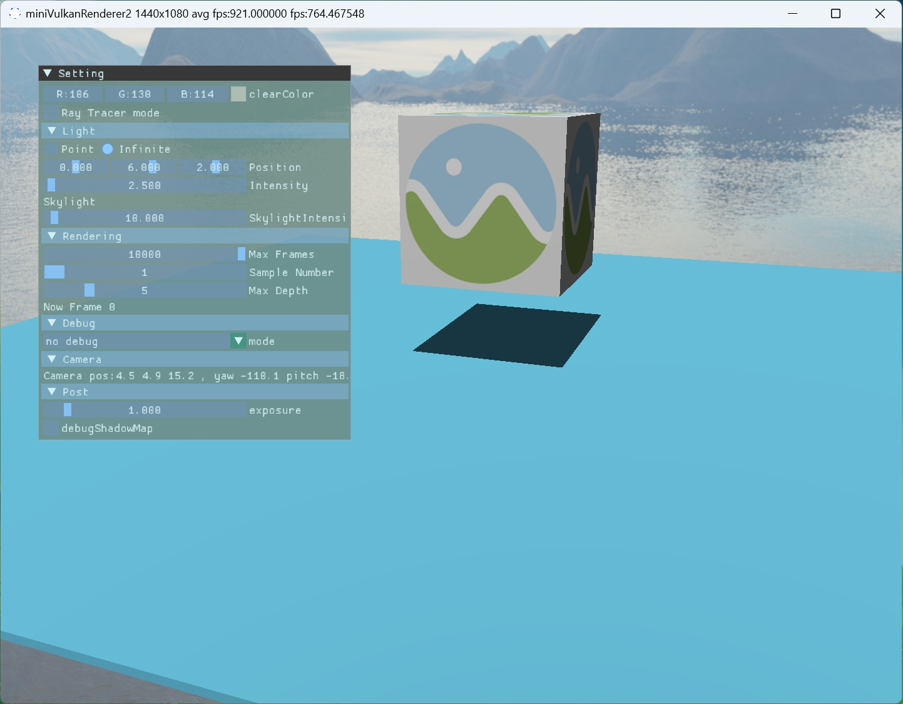
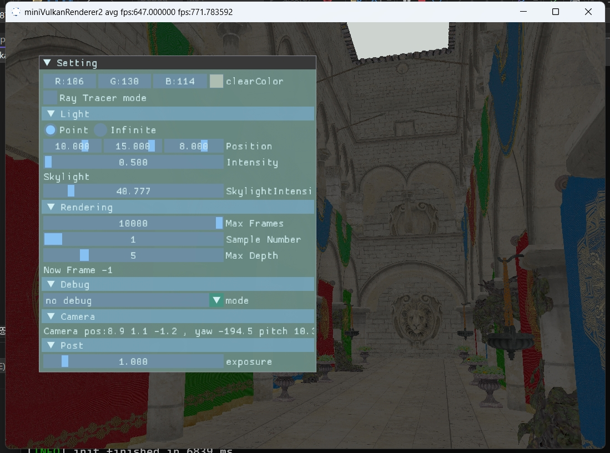

# miniVulkanRenderer2
 A mini renderer using Vulkan
 ## 1. Features
 * PBR
 * PathTrace
 * SubPass
 ## 2. Screenshot
* Raster

* RayTracing

 ### 2.1 RayTracing
* Demo

* Normal Map 

 
 

more RayTracing sample 

* Emission 

* Alpha Test

* MetalRoughSpheres

* Normal Tangent Test

* HDR

 
 

### 2.2 rasterization

* ShadowMapPass

* SkyBoxPass

 
 

rasterization features is still on building

 
 
 
## 3. ThirdParty
* imgui
* tinygltf
* tinyobjloader
* volk
* stb_image
