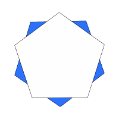

# miniVulkanRenderer2

<div align="center">

<p>
 A mini renderer using Vulkan
</div>

 ## 0. TODO
 - [ ] Linux / MacOS Support
 - [ ] Rendering performance optimization

 ## 0.1 Install && Build

 ### Linux
 Ubuntu 24.04:
```
sudo apt update
sudo apt install libvulkan-dev vulkan-tools vulkan-utility-libraries-dev libglfw3-dev vulkan-validationlayers

```

 ## 1. Features
 * PBR
 * PathTrace
 * SubPass
 * SSAO
 * SSR
 * Physical Based Bloom

## 2. Screenshot


[Detail](Screenshot.md)
 
## 3. ThirdParty
* imgui
* tinygltf
* tinyobjloader
* volk
* stb_image
