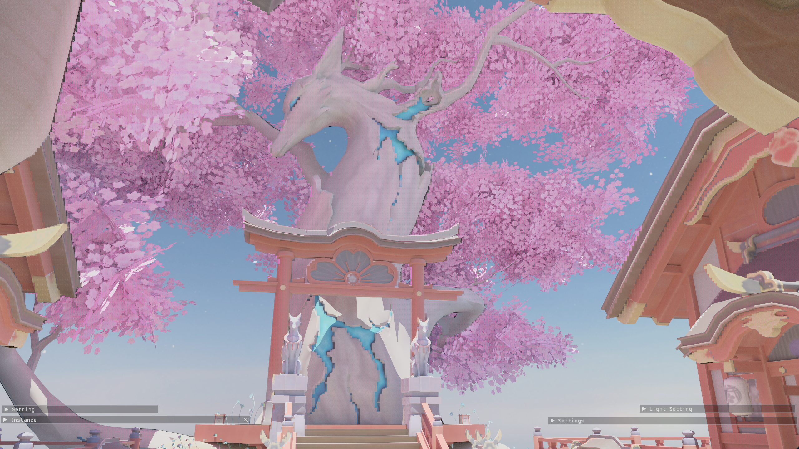

  
  
  <h3>miniVulkanRenderer2</h3>
  
A Lightweight & Modern Vulkan Renderer

  
  
<em><b>Grand Narukami Shrine</b> from Genshin Impact. Rendered in real-time with Path Tracing.</em>

## 🌟 Features
 * **Path Trace**: Hardware-accelerated ray tracing with Next Event Estimation (NEE).
 * **PBR Material**: Standard Metallic-Roughness workflow with Alpha Clipping.
 * **Render Graph**: Vulkan SubPass management.
 * **Global Illumination**: Screen Space Ambient Occlusion (SSAO) & Screen Space Reflections (SSR)
 * **Post-Processing**: Physically Based Bloom

## 🖼️ Gallery

[Screenshot Gallery](Screenshot.md)

## 🚀 Build & Install 
[Install Guide](Install.md)

## 📋 TODO
 - [x] Linux Support
 - [ ] Compute Shader (Bloom / Animation)
 - [ ] FSR
 - [ ] VR Support
 - [ ] MacOS Support
 - [ ] Configurable render quality options

 
## 📚 Third-Party Libraries
* [imgui](https://github.com/ocornut/imgui)
* [tinygltf](https://github.com/syoyo/tinygltf)
* [tinyobjloader](https://github.com/tinyobjloader/tinyobjloader)
* [volk](https://github.com/zeux/volk)
* [stb_image](https://github.com/nothings/stb)

## ❤️ Acknowledgements

* **Assets**: Scene model from *Genshin Impact*.
* **Pair Programming**: Thanks to ✨Gemini for helping me fix bugs.