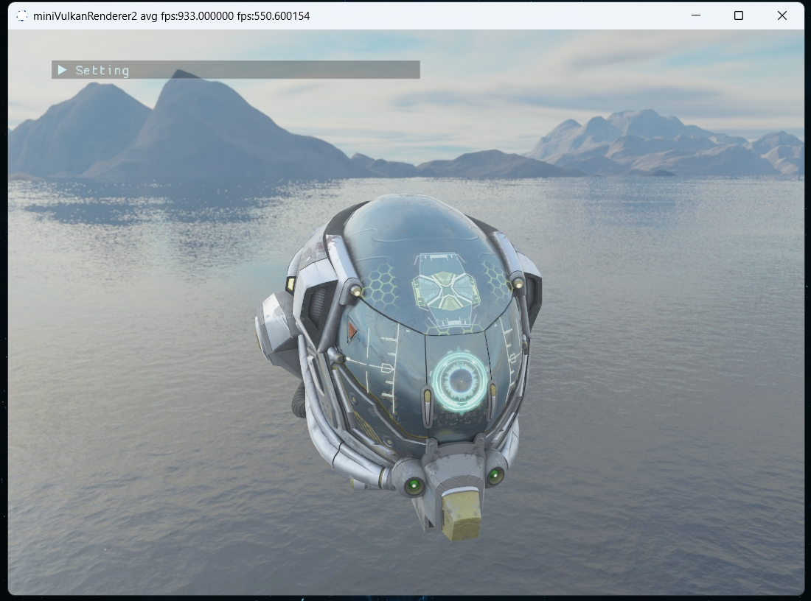

# miniVulkanRenderer2
 A mini renderer using Vulkan
 ## Features
 * PBR
 * PathTrace
 ## Screenshot
* Demo

* Normal Map 

* Emission 

* Alpha Test

* hdr

## ThirdParty
* imgui
* tinygltf
* tinyobjloader
* volk
* stb_image
