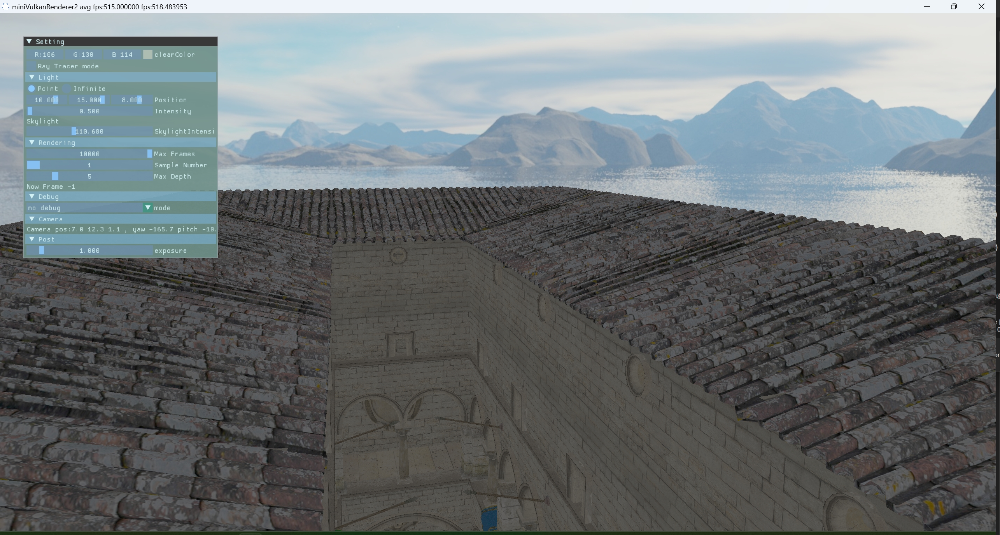

# miniVulkanRenderer2
 A mini renderer using Vulkan
 ## 1. Features
 * PBR
 * PathTrace
 * SubPass
 * SSAO
 * SSR
 * Physical Based Bloom
 ## 2. Screenshot
* Raster

* RayTracing

### 2.1 rasterization

#### Overall Process 

#### detail features

* SSR

|   |  |
| --- | --- |
| result | SSR texture |

[implement detail](https://yufeiran.com/ping-mu-kong-jian-fan-she-vulkanshi-xian/)

* PBBloom

* mulitLights

* ShadowMapPass

* SkyBoxPass

 
 

rasterization features is still on building

 
 

 ### 2.2 RayTracing
* Demo

* Normal Map 

 
 

more RayTracing sample 

* Emission 

* Alpha Test

* MetalRoughSpheres

* Normal Tangent Test

* HDR

 
 

 
## 3. ThirdParty
* imgui
* tinygltf
* tinyobjloader
* volk
* stb_image
